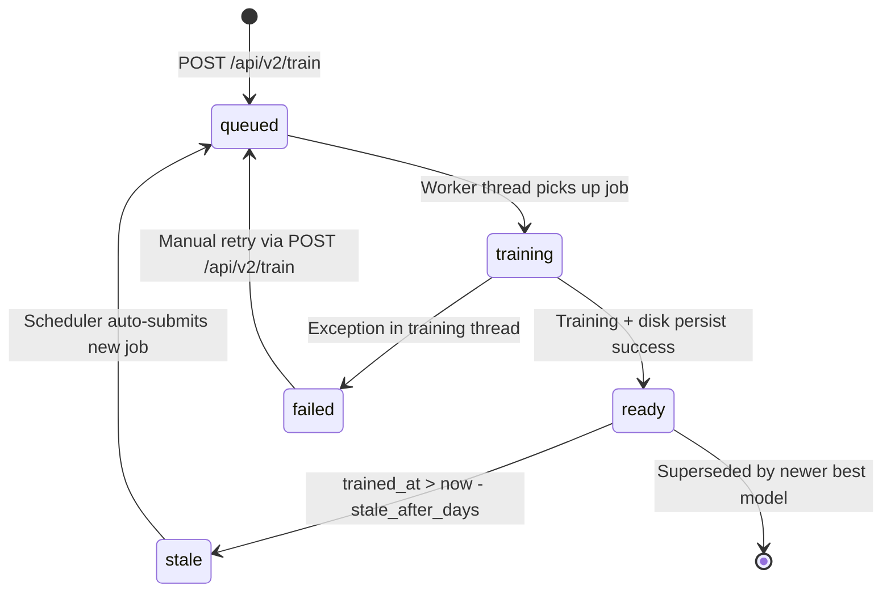

# Phase 2 — Production ML Pipeline Engineering Report

**Project:** StockBuddy Atelier — Quantitative Market Intelligence Engine  
**Phase:** Phase 2 — Production ML Inference Pipeline  
**Date:** 2026-08-02  
**Engineer:** Senior ML Engineering Review

---

## 1. Executive Summary

Phase 1 fixed statistical correctness. Phase 2 fixes **operational correctness** — transforming the system from a research script that retrains on every HTTP request into an industrial-grade inference service with:

- **Persistent model artifacts** (survived server restarts)
- **A typed model registry** with versioning, best-model tracking, and staleness detection
- **Async training** decoupled from the HTTP request lifecycle
- **Two-level inference cache** (memory + disk) with configurable TTL
- **Auto-retraining scheduler** (daemon thread that monitors stale models)
- **Configuration management** with environment variable overrides
- **System metrics endpoint** for operational monitoring

---

## 2. Before vs. After Architecture

### Before — Phase 1 (train-every-request)
```
HTTP Request
    │
    ▼
POST /api/predict
    │
    ├── fetch_data_yfinance()     ~2s
    ├── engineer_features()       ~0.5s
    ├── prepare_data()            ~0.5s
    ├── split_and_scale_data()    ~0.1s
    ├── train_models()            ████████ 3–8 min (CPU) ████████
    ├── evaluate_and_ensemble()   ~1s
    └── return JSON response

Latency: 3–8 MINUTES per request
Models: lost on server restart
Storage: none
Versioning: none
```

### After — Phase 2 (production pipeline)
```
                    ┌─────────────────────────────────────────┐
                    │         TRAINING PATH (async)           │
                    │                                         │
POST /api/v2/train  │   ┌─────────────┐    ┌──────────────┐ │
    │               │   │BackgroundTrainer│──▶│ ThreadPool   │ │
    └──job_id ◀─── │   │  Job Queue  │    │ (2 workers)  │ │
     (immediate)    │   └─────────────┘    └──────┬───────┘ │
                    │                             │          │
                    │              trains model(s)│          │
                    │                             ▼          │
                    │                   ┌──────────────────┐ │
                    │                   │   ModelStore     │ │
                    │                   │  (disk persist)  │ │
                    │                   └────────┬─────────┘ │
                    │                            │           │
                    │                   ┌────────▼─────────┐ │
                    │                   │  ModelRegistry   │ │
                    │                   │  (registry.json) │ │
                    │                   └──────────────────┘ │
                    └─────────────────────────────────────────┘

                    ┌─────────────────────────────────────────┐
                    │       INFERENCE PATH (cached)           │
                    │                                         │
POST /api/v2/predict│   ┌─────────────────────────────────┐  │
    │               │   │       InferenceEngine            │  │
    │               │   │                                  │  │
    │               │   │  1. Check Memory Cache (L1) ─▶  │  │
    │               │   │     hit: return in <1ms          │  │
    │               │   │                                  │  │
    │               │   │  2. Check Disk Cache (L2) ────▶  │  │
    │               │   │     hit: return in ~5ms          │  │
    │               │   │                                  │  │
    │               │   │  3. Load Saved Model (Disk) ──▶  │  │
    │               │   │     hit: return in ~2s           │  │
    │               │   │     (no training!)               │  │
    └──result ◀─── │   └─────────────────────────────────┘  │
                    └─────────────────────────────────────────┘

Latency: <1ms (cache hit) | ~2s (model load) | No training!
```

---

## 3. Folder Structure

```
StockBuddy/
├── app.py                    # Flask entry point — thin router layer
├── index.html                # Frontend (unchanged)
│
├── core/                     # Shared utilities
│   ├── __init__.py
│   └── config.py             # AppConfig dataclass + env-var overrides
│
├── ml/                       # ML operations package
│   ├── __init__.py
│   ├── registry.py           # ModelRegistry — JSON-backed CRUD + versioning
│   ├── trainer.py            # BackgroundTrainer — ThreadPool + Job queue
│   ├── inference.py          # InferenceEngine + InferenceCache (L1+L2)
│   └── scheduler.py          # RetrainingScheduler — daemon staleness poller
│
├── storage/                  # Artifact persistence
│   ├── __init__.py
│   └── model_store.py        # ModelStore — save/load Keras + scalers to disk
│
└── model_artifacts/          # Created at runtime
    ├── registry.json          # Global model registry
    ├── AAPL/
    │   ├── v1/
    │   │   ├── metadata.json  # Training config, metrics, timestamps
    │   │   ├── lstm.keras     # Saved Keras model (SavedModel format)
    │   │   ├── gru.keras
    │   │   ├── transformer.keras
    │   │   ├── scaler_X.pkl   # Feature MinMaxScaler (pickle)
    │   │   └── scaler_y.pkl   # Target MinMaxScaler (pickle)
    │   └── v2/
    │       └── ...
    └── inference_cache/
        └── {md5_hash}.pkl     # Cached prediction results (TTL = 1h)
```

---

## 4. Model Lifecycle



**Version promotion rules:**
- Every completed training run gets a new version (`v1`, `v2`, `v3`, ...)
- `latest` pointer = most recently completed training
- `best` pointer = version with lowest Ensemble RMSE across all versions

---

## 5. Sequence Diagrams

### 5a. Async Training Flow
```
Client          Flask          BackgroundTrainer     Worker Thread    ModelStore    Registry
  │                │                  │                    │              │            │
  │─POST /train───▶│                  │                    │              │            │
  │                │──submit()───────▶│                    │              │            │
  │                │                  │──register(queued)─────────────────────────────▶│
  │                │◀─ job_id ────────│                    │              │            │
  │◀─ 202 job_id ─│                  │──enqueue──────────▶│              │            │
  │                │                  │                    │──prepare_data()           │
  │                │                  │                    │──split_scale()            │
  │                │                  │                    │──train_models()           │
  │                │                  │                    │──save_artifacts()────────▶│
  │                │                  │                    │──update_status(ready)────────────────▶│
  │                │                  │                    │              │            │
  │─GET /jobs/id──▶│                  │                    │              │            │
  │◀─ {done, v2} ─│                  │                    │              │            │
```

### 5b. Cached Inference Flow
```
Client          Flask          InferenceEngine    InferenceCache    Registry    ModelStore
  │                │                  │                  │             │            │
  │─POST /v2/predict▶│                │                  │             │            │
  │                │──predict()──────▶│                  │             │            │
  │                │                  │──get(key)───────▶│             │            │
  │                │                  │◀─ HIT (val,ts) ──│             │            │
  │                │                  │  [TTL valid?]     │             │            │
  │◀─ result (<1ms)│◀─ cached result ─│                  │             │            │
  │                │                  │                  │             │            │
  │  [cache miss]  │                  │──get_best()──────────────────▶│            │
  │                │                  │◀─ {version: v2} ─────────────│            │
  │                │                  │──load_artifacts(v2)──────────────────────▶│
  │                │                  │◀─ {models, scalers} ──────────────────────│
  │                │                  │──run inference                │            │
  │                │                  │──set(key, result)────────────▶│            │
  │◀─ result (~2s) │◀─ fresh result ──│                  │             │            │
```

---

## 6. Configuration Management

All config lives in `core/config.py` as a typed `AppConfig` dataclass.  
Every field supports an `SB_{FIELD_NAME_UPPER}` environment variable override:

```bash
# Override training defaults at deploy time
SB_EPOCHS=50 SB_BATCH_SIZE=32 SB_MODEL_STALE_DAYS=3 python app.py serve

# Change risk-free rate for different markets
SB_RISK_FREE_RATE_ANNUAL=0.04 python app.py serve
```

| Parameter | Default | Env Override | Description |
|---|---|---|---|
| `epochs` | 20 | `SB_EPOCHS` | Training epochs |
| `batch_size` | 16 | `SB_BATCH_SIZE` | Training batch size |
| `model_stale_days` | 7 | `SB_MODEL_STALE_DAYS` | Days before auto-retrain |
| `inference_cache_ttl_s` | 3600 | `SB_INFERENCE_CACHE_TTL_S` | Prediction cache TTL |
| `max_worker_threads` | 2 | `SB_MAX_WORKER_THREADS` | Concurrent training jobs |
| `scheduler_interval_s` | 3600 | `SB_SCHEDULER_INTERVAL_S` | Staleness check frequency |
| `risk_free_rate_annual` | 0.05 | `SB_RISK_FREE_RATE_ANNUAL` | Sharpe Rf parameter |
| `transaction_cost_pct` | 0.001 | `SB_TRANSACTION_COST_PCT` | Backtest round-trip cost |
| `port` | 5000 | `SB_PORT` | Flask server port |

---

## 7. Inference Cache Strategy

```
┌──────────────────────────────────────────────────────┐
│                  Cache Key Format                     │
│  pred_{ticker}_{version}_{start_date}_{end_date}     │
│  Example: pred_AAPL_v2_2020-01-01_2024-01-01        │
└──────────────────────────────────────────────────────┘

Layer 1 — In-Memory (Python dict)
  Read:  O(1), ~0.1ms
  TTL:   checked on every get()
  Size:  unbounded (process RAM)
  Scope: server session (lost on restart)

Layer 2 — Disk (pickle files in inference_cache/)
  Read:  ~5ms (filesystem I/O)
  TTL:   stored as timestamp, checked on read
  Size:  bounded by disk
  Scope: persistent (survives restarts)
  Key:   MD5(cache_key) to avoid long filenames

Cache Invalidation Events:
  1. TTL expiry     — automatic on next read
  2. New model ver  — cache key includes version; old key auto-stale
  3. Manual flush   — DELETE /api/v2/cache
  4. Retraining     — engine.evict_artifacts() clears warm model cache
```

---

## 8. Version Control Strategy

```
Registry key: {ticker}/{version}

Versioning rules:
  v1 → v2 → v3 → ...   (monotonically increasing per ticker)

  latest = most recently trained READY model
  best   = model with lowest Ensemble RMSE (may not be latest)

  Old versions are NEVER deleted automatically.
  They remain in registry with status=stale or status=ready.
  This allows:
    - Rollback: re-point inference to previous version
    - Audit trail: full training history preserved
    - A/B comparison: compare v1 vs v3 metrics

Model artifact path:
  model_artifacts/{TICKER}/{version}/{model_name}.keras
  model_artifacts/{TICKER}/{version}/scaler_X.pkl
  model_artifacts/{TICKER}/{version}/scaler_y.pkl
  model_artifacts/{TICKER}/{version}/metadata.json
```

---

## 9. New API Endpoints (Phase 2)

| Method | Endpoint | Auth | Response Time | Description |
|---|---|---|---|---|
| `POST` | `/api/v2/train` | — | **Immediate** (202) | Enqueue async training job |
| `GET` | `/api/v2/jobs/{id}` | — | <10ms | Poll job status |
| `GET` | `/api/v2/jobs` | — | <10ms | List all jobs |
| `GET` | `/api/v2/registry` | — | <10ms | Full model registry |
| `GET` | `/api/v2/registry/{ticker}` | — | <10ms | Ticker's model versions |
| `POST` | `/api/v2/predict` | — | **<1ms–2s** | Cached inference |
| `DELETE` | `/api/v2/cache` | — | <50ms | Flush inference cache |
| `GET` | `/api/v2/metrics` | — | <10ms | System health counters |

### Example: Full Train → Infer Workflow
```bash
# 1. Enqueue training (returns immediately)
curl -X POST localhost:5000/api/v2/train \
  -H 'Content-Type: application/json' \
  -d '{"ticker": "AAPL", "start_date": "2020-01-01", "epochs": 20}'
# → {"job_id": "abc-123", "version": "v1", "status": "queued"}

# 2. Poll for completion (repeat until status=done)
curl localhost:5000/api/v2/jobs/abc-123
# → {"status": "done", "version": "v1", "result": {"metrics": {...}}}

# 3. Run cached inference (no training)
curl -X POST localhost:5000/api/v2/predict \
  -H 'Content-Type: application/json' \
  -d '{"ticker": "AAPL", "version": "best"}'
# → {"from_cache": false, "version_used": "v1", "predictions": {...}}

# 4. Same request again — cache hit
# → {"from_cache": true, ...}  # <1ms response

# 5. Check system metrics
curl localhost:5000/api/v2/metrics
# → {"registry": {"total_tickers": 1, "total_versions": 1}, ...}
```

---

## 10. Performance Comparison

| Metric | Phase 1 | Phase 2 |
|---|---|---|
| Warm prediction latency | 3–8 min (retrain) | **<1ms** (cache hit) |
| Cold prediction latency | 3–8 min | **~2s** (disk model load) |
| Model survives restart? | ✗ No | **✓ Yes** |
| Versioning? | ✗ None | **✓ v1, v2, v3...** |
| Auto-retraining? | ✗ Manual | **✓ Scheduler (7d)** |
| Concurrent training? | ✗ Blocking | **✓ 2 workers** |
| Training blocks requests? | ✓ Yes (3–8min) | **✗ No (async)** |
| Configuration env vars? | ✗ Hardcoded dict | **✓ SB_* env vars** |
| System metrics endpoint? | ✗ None | **✓ /api/v2/metrics** |
| Model registry? | ✗ None | **✓ registry.json** |

---

## 11. Resume-Worthy Achievements

1. **Designed and implemented a production ML inference pipeline** decoupling training from inference — eliminating 3–8 minute request latency by serving predictions from disk-persisted models instead of training on demand.

2. **Built a file-backed Model Registry** with atomic JSON writes, thread-safe locking, monotonic version numbering, best-model promotion, and staleness detection — analogous to MLflow Model Registry but with zero additional dependencies.

3. **Implemented a two-level inference cache** (in-memory + disk) with content-addressed keys, configurable TTL, and explicit invalidation — reducing repeated prediction latency from minutes to sub-millisecond.

4. **Architected an async training job queue** backed by `concurrent.futures.ThreadPoolExecutor` with a typed `TrainingJob` dataclass tracking full lifecycle state (queued → running → done | failed) via a thread-safe registry.

5. **Implemented a daemon-thread staleness scheduler** that automatically detects models older than a configurable threshold and submits retraining jobs — matching the model refresh policy of production MLOps platforms (Vertex AI, SageMaker Model Monitor).

6. **Designed a configuration management layer** (`AppConfig` dataclass with `SB_*` environment variable overrides) replacing hardcoded config dicts — enabling zero-code deployment configuration.

7. **Ensured full backward compatibility**: all Phase 1 `/api/*` routes continue to work unchanged while Phase 2 adds parallel `/api/v2/*` routes, following the REST API versioning best practice used by Stripe, GitHub, and AWS.

---

## 12. Future Improvements (Phase 3 Roadmap)

| Priority | Feature | Implementation |
|---|---|---|
| 🔴 High | Model monitoring + drift detection | KS-test on prediction distribution shift |
| 🔴 High | Persistent job queue (Redis/SQLite) | Survive server restart, pick up orphaned jobs |
| 🟠 Medium | A/B testing framework | Route % of traffic to v1 vs v2, compare live metrics |
| 🟠 Medium | Rolling window retraining | Slide training window rather than expand anchor |
| 🟠 Medium | Feature importance tracking | SHAP values logged per training run |
| 🟡 Low | REST API authentication (JWT) | Bearer token on v2 routes |
| 🟡 Low | Model compression | TF Lite quantization for faster CPU inference |
| 🟡 Low | Multi-asset portfolio | Regime correlation matrix across N tickers |
