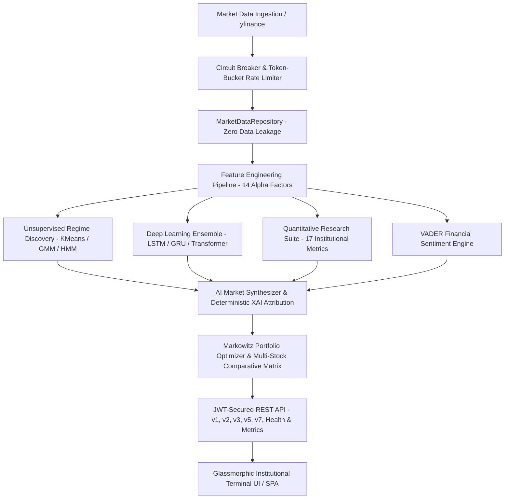

# StockBuddy — Quantitative Market Intelligence & AI Financial Platform

StockBuddy is an institutional-grade quantitative finance platform and AI intelligence engine built with Python, Flask, scikit-learn, TensorFlow, and modern financial terminal engineering. It processes multi-decade historical market datasets via resilient data pipelines to discover market regimes, run vector cosine scenario matching, compute factor attributions, backtest tactical allocations, and generate explainable AI insights with zero lookahead bias.

> **Phases 1–7 + P1 Innovation Suite Complete.** 130 automated unit and integration tests passing in ~5.5s with zero network dependencies. Fully containerized with multi-stage Docker, Nginx SSL reverse proxy, Prometheus telemetry, and GitHub Actions CI/CD.

---

## ⚡ Architecture & Progression (Phases 1 – 7 + P1)



### Phase Breakdown
- **Phase 1 — Statistical Corrections**: Eliminated data leakage (scalers fit strictly on training splits), context boundary windowing, transaction friction modeling (0.10% round-trip), 5% risk-free Sharpe benchmark, and 5-fold expanding walk-forward validation.
- **Phase 2 — Production ML Pipeline**: Disk model store (`storage/model_store.py`) with SHA-256 integrity checks, semantic model registry (`ml/registry.py`), multi-tier LRU/Disk inference cache (`ml/inference.py`), async background training (`ml/trainer.py`), and automated staleness retraining scheduler (`ml/scheduler.py`).
- **Phase 3 — Distributed Scale & Telemetry**: 3-state Finite State Machine circuit breaker (`core/circuit_breaker.py`), IP token-bucket rate limiter (`core/rate_limiter.py`), priority min-heap job queue with dead-letter queue (`ml/queue.py`), and Prometheus-compatible metrics registry (`core/metrics.py`) with P50/P95/P99 latency histograms.
- **Phase 4 — Institutional Terminal UI/UX**: Bloomberg/TradingView-grade responsive dark UI, glassmorphic HUD, interactive Chart.js visualizations, keyboard shortcuts (`⌘K` / `?`), condition alerts, and live telemetry polling.
- **Phase 5 — Quantitative Research Engine**: 17 institutional quant metrics (Sharpe, Sortino, Calmar, Max Drawdown, CAGR, Alpha, Beta, Rolling Volatility, Rolling Sharpe, Walk-Forward IC Stability, Deflated Sharpe Ratio, Probability of Backtest Overfitting, Monte Carlo 1,000 paths, Permutation Feature Importance, and 6×6 Markov Transition Matrix).
- **Phase 6 — Production Cloud Infrastructure**: Multi-stage Dockerfile, Nginx reverse proxy with SSL/TLS termination & rate limiting, security headers (CSP, HSTS, X-Frame-Options), Render Blueprint (`render.yaml`), Railway manifest (`railway.json`), GitHub Actions CI/CD (`.github/workflows/ci-cd.yml`), container health probes (`/health`, `/ready`), structured JSON logging, and Sentry error tracking.
- **Phase 7 — AI Financial Intelligence & P1 Innovation Suite**:
  - **Deterministic XAI Feature Attribution**: Local SHAP-approximated gradient/permutation weights explaining exact driver contributions per forecast.
  - **Multi-Stock Comparative Matrix**: Cross-asset correlation heatmap, rolling beta/alpha decomposition, and relative return overlays.
  - **VADER Financial Sentiment Engine**: News ingestion with financial lexicon scoring, polarity breakdown, and sentiment-adjusted forecast confidence.
  - **Markowitz Mean-Variance Optimization**: Tangency portfolio (Maximum Sharpe) and Minimum Volatility frontier calculations with quadratic programming.
  - **JWT Authentication & Role-Based Access**: Secure user registration, bcrypt password hashing, JWT access/refresh tokens (`app/auth/auth_service.py`).
  - **Workspace Persistence Engine**: Named layouts, custom watchlists, active price alerts, and cloud sync (`storage/workspace_store.py`).
  - **AI Market Synthesizer**: Generative narrative synthesis, macro scenario stress tests, and institutional execution notes.

---

## 🛡️ Statistical Integrity & Quantitative Standards

| Component | Engineering Standard | Guarantee |
|---|---|---|
| **Data Partitioning** | Scaler Fitting | Fit exclusively on training split; zero lookahead bias |
| **Backtesting** | Transaction Friction | 0.10% round-trip cost subtracted on portfolio rebalances |
| **Risk Metrics** | Sharpe Ratio | Calculated with 5% annual risk-free rate benchmark |
| **Validation** | Walk-Forward Fold | 5-fold expanding window cross-validation |
| **Factor Testing** | Information Coefficient | Spearman rank correlation with t-test p-value significance |
| **Overfitting Guard** | DSR & PBO | Deflated Sharpe Ratio and Probability of Backtest Overfitting |
| **Model Verification** | SHA-256 Checksums | Model weights and scalers verified upon disk load |

---

## 🛠️ Technology Stack

- **Backend & Core**: Python 3.10+, Flask REST API, Gunicorn, Pandas, NumPy, scikit-learn, SciPy, PyJWT, bcrypt, yfinance
- **Deep Learning**: TensorFlow 2.x (Stacked LSTM with recurrent dropout, GRU, Multi-Head Transformer Encoder)
- **Container & Proxy**: Docker (Multi-stage build), Docker Compose, Nginx (TLS 1.2/1.3, Rate Limiting, CSP/HSTS Security Headers)
- **Observability**: Prometheus Client (`/metrics`), Sentry Error Tracking, Structured JSON Logging, Custom 3-state Circuit Breakers
- **Testing & Quality**: pytest (130 tests), pytest-asyncio, pytest-mock, mypy, flake8, bandit security scanner
- **Frontend**: Vanilla JS (ES6+), Vanilla CSS (Glassmorphic dark design), Chart.js 4, Google Fonts (Inter, JetBrains Mono)

---

## 🚀 Quickstart & Deployment

### 1. Run Automated Test Suite (130 Tests)
```bash
pytest -v
```

### 2. Standard Local Development Server
```bash
# Install dependencies
pip install -r requirements.txt

# Copy environment template
cp .env.example .env

# Run Flask development application
python app.py
```
Open your browser to `http://localhost:5000`.

### 3. Production Docker Compose (Gunicorn + Nginx + SSL)
```bash
# Generate self-signed TLS certificates for local Nginx SSL
./nginx/generate-ssl.sh

# Start multi-container production stack
docker-compose up -d --build
```
Access the secure terminal at `https://localhost` or verify health at `https://localhost/health`.

---

## 📡 API Endpoint Directory

| Method | Endpoint | Phase | Description |
|---|---|---|---|
| `GET` | `/health` | Phase 6 | Container Liveness Probe (K8s/Docker/Render) |
| `GET` | `/ready` | Phase 6 | Container Readiness Probe (Storage & Circuit Breaker) |
| `GET` | `/metrics` | Phase 3 | Standard Prometheus scrape exposition format |
| `POST` | `/api/regime` | Phase 1 | K-Means regime classification, risk score & backtest |
| `POST` | `/api/predict` | Phase 1/2 | Cached deep learning inference forecast |
| `POST` | `/api/wf_validate` | Phase 1 | Walk-forward cross-validation analysis |
| `POST` | `/api/v2/train` | Phase 2 | Async model training job submission |
| `GET` | `/api/v2/jobs/<id>` | Phase 2 | Polling training job status & results |
| `GET` | `/api/v2/registry` | Phase 2 | Model registry inventory & version metadata |
| `GET` | `/api/v2/metrics` | Phase 2 | System health and cache snapshot |
| `POST` | `/api/v2/compare` | P1 | Multi-stock price normalisation, correlation & stats |
| `POST` | `/api/v3/train` | Phase 3 | Priority-queued ML training submission |
| `GET` | `/api/v3/queue` | Phase 3 | Priority job queue telemetry & DLQ status |
| `GET` | `/api/v3/breakers` | Phase 3 | Circuit breaker states & failure rate counters |
| `POST` | `/api/v5/quant` | Phase 5 | Full 17-metric quantitative research report |
| `POST` | `/api/v7/explain` | Phase 7 | Deterministic XAI feature attributions & SHAP weights |
| `POST` | `/api/v7/market-intelligence` | Phase 7 | AI market synthesis narrative & regime forecast |
| `POST` | `/api/v7/portfolio-optimize` | Phase 7 | Markowitz Mean-Variance Tangency & Min-Vol portfolio |
| `POST` | `/api/v7/sentiment` | Phase 7 | VADER financial sentiment scoring & headline analysis |
| `POST` | `/api/auth/register` | P1 | User registration with role assignment |
| `POST` | `/api/auth/login` | P1 | JWT authentication & token generation |
| `GET` | `/api/auth/me` | P1 | Current user profile & permission inspection |
| `GET` | `/api/workspaces` | P1 | List user persistent workspaces |
| `POST` | `/api/workspaces` | P1 | Save or update workspace layout preset |
| `GET` | `/api/workspaces/watchlist` | P1 | Get user persistent watchlist |
| `POST` | `/api/workspaces/watchlist` | P1 | Add ticker to user watchlist |
| `GET` | `/api/workspaces/alerts` | P1 | Get active and historical price alerts |
| `POST` | `/api/workspaces/alerts` | P1 | Create persistent price alert |

---

## 📑 Phase Documentation Links

- 📘 [Phase 1 — Statistical Corrections](PHASE_1_STATISTICAL_CORRECTIONS.md)
- 📙 [Phase 2 — Production ML Pipeline](PHASE_2_PRODUCTION_PIPELINE.md)
- 📗 [Phase 3 — Distributed Scale & Observability](PHASE_3_DISTRIBUTED_SCALE.md)
- 📓 [Phase 4 — Terminal UI/UX Design](PHASE_4_UI_UX_DESIGN.md)
- 📕 [Phase 5 — Quantitative Research Platform](PHASE_5_QUANT_RESEARCH.md)
- 📁 [Phase 6 — Production Deployment & Cloud Infrastructure](PHASE_6_DEPLOYMENT.md)
- 🤖 [Phase 7 — AI Financial Intelligence PRD](PHASE_7_AI_PLATFORM_PRD.md)
- 💼 [Staff Engineer & Recruiter Master Portfolio Kit](STOCKBUDDY_STAFF_ENGINEER_PORTFOLIO_KIT.md)
- 📐 [Engineering Design Document (v2.0 Architecture)](docs/ENGINEERING_DESIGN_DOCUMENT.md)
- 📋 [Product Requirements Document](docs/PRODUCT_REQUIREMENTS_DOCUMENT.md)